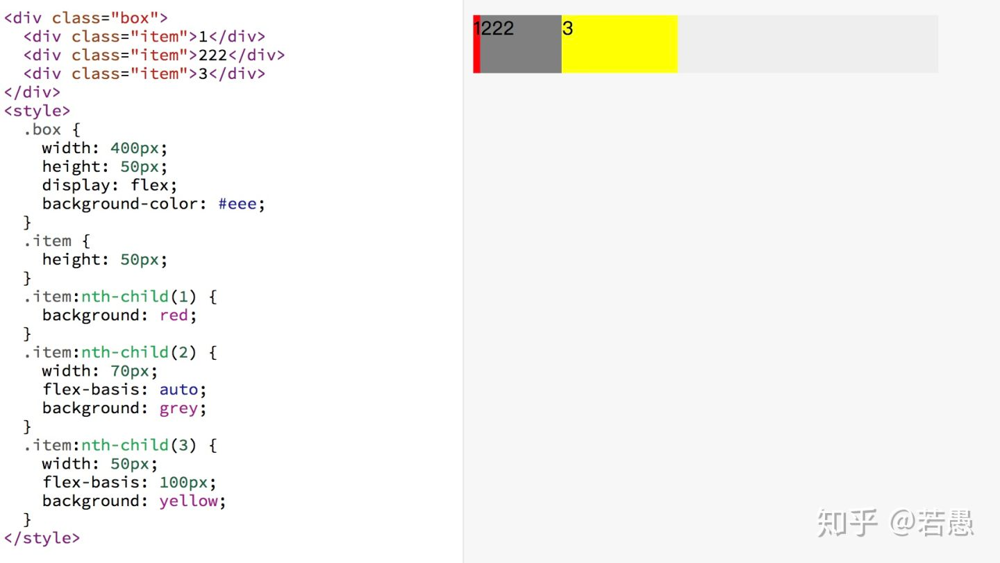
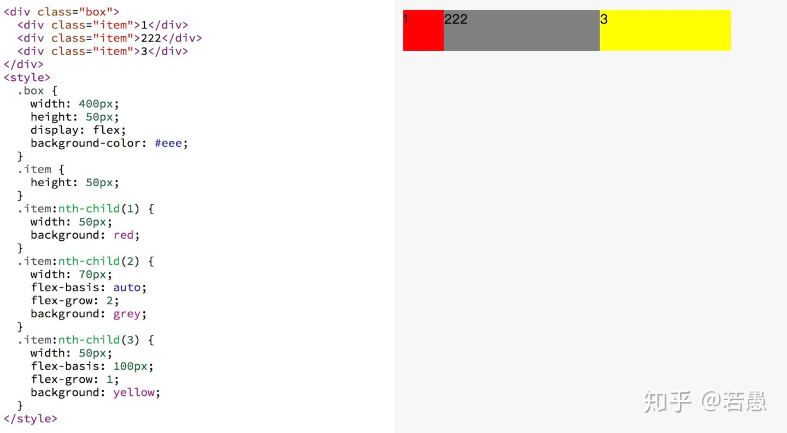
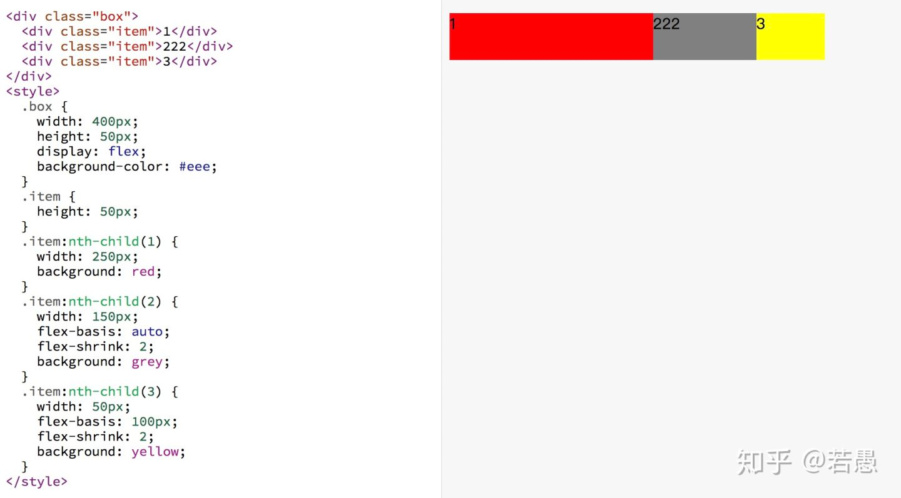

<!-- toc -->

`<'flex-grow'>`
定义 flex 元素的 flex-grow 属性，详见 <number>。默认值为 0，负值无效。

`<'flex-shrink'>`
定义 flex 元素的 flex-shrink 属性，详见 <number>。默认值为1，负值无效。

`<'flex-basis'>`
定义 flex 元素的 flex-basis 属性。若值为0，则必须加上单位，以免被视作伸缩性。 默认值为 auto。

> 转载自 https://zhuanlan.zhihu.com/p/39052660

## flex-basis
flex-basis 用于设置子项的占用空间。如果设置了值，则子项占用的空间为设置的值；如果没设置或者为 auto，那子项的空间为width/height 的值。

+ 对于子项1，flex-basis 如果设置默认是auto，子项占用的宽度使用width 的宽度，width没设置也为 auto，所以子项占用空间由内容决定。
+ 对于子项2，flex-basis 为auto，子项占用宽度使用width 的宽度，width 为70px，所以子项子项占用空间是70px。
+ 对于子项3，flex-basis 为100px，覆盖width 的宽度，所以子项占用空间是100px。  
  
## flex-grow
用来“瓜分”父项的“剩余空间”。

容器的宽度为400px, 子项1的占用的基础空间(flex-basis)为50px，子项2占用的基础空间是70px，子项3占用基础空间是100px，剩余空间为 400-50-70-100 = 180px。 其中子项1的flex-grow: 0(未设置默认为0)， 子项2flex-grow: 2，子项3flex-grow: 1，剩余空间分成3份，子项2占2份(120px)，子项3占1份(60px)。所以 子项1真实的占用空间为: 50+0 = 50px， 子项2真实的占用空间为: 70+120 = 190px， 子项3真实的占用空间为: 100+60 = 160px。  

## flex-shrink
用来“吸收”超出的空间

容器的宽度为400px, 子项1的占用的基准空间(flex-basis)为250px，子项2占用的基准空间是150px，子项3占用基准空间是100px，总基准空间为 250+150+100=500px。容器放不下，多出来的空间需要被每个子项根据自己设置的flex-shrink 进行吸收。 子项1的flex-shrink: 1(未设置默认为1)， 子项2 flex-shrink: 2，子项3 flex-shrink: 2。子项1需要吸收的的空间为 `(250*1)/(250*1+150*2+100*2) * 100 = 33.33px`，子项1真实的空间为 250-33.33 = 216.67px。同理子项2吸收的空间为`(150*2)/(250*1+150*2+100*2) * 100=40px`，子项2真实空间为 150-40 = 110px。子项3吸收的空间为`(100*2)/(250*1+150*2+100*2) * 100 = 26.67px`，真实的空间为100-26.67=73.33px。
